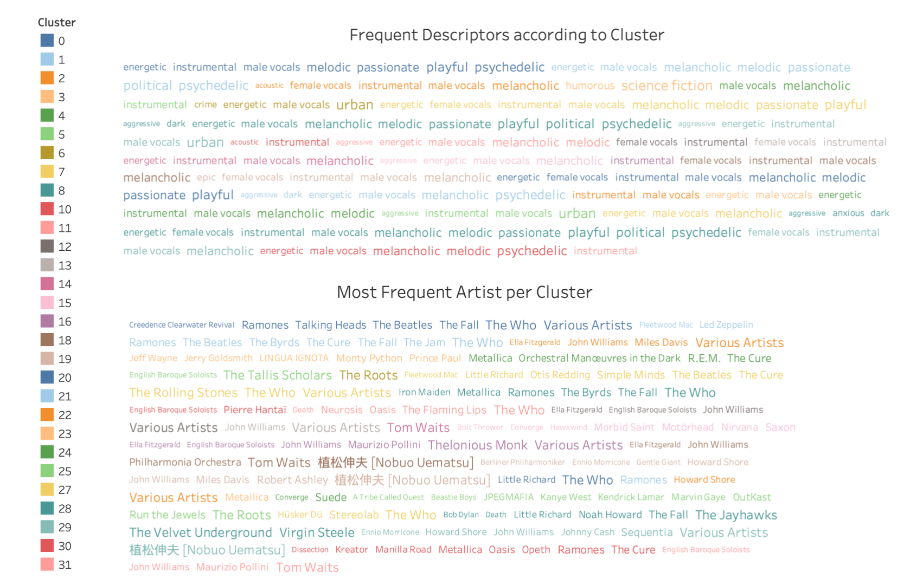

# Musical Spirits: A new way of categorising music
GA | DSI Capstone Project | 2020 | Aaron Breuer-Weil

---

We're in a new era of music consumption.

Digital natives have instant access to global culture, musical styles have cross-pollinated and listeners now take recommendations from algorithms. People care less for single genre charts and they are less likely to be influenced by single musical sources - out with the days of Radio DJs.

This era of change has seen genre lose its ability to effectively categorise people’s musical taste. Consumers and artists are interested in so much more than adhering to one musical 'style'.

Rather than continuing to use genre, might there be a mode of categorisation that better represents people’s new broadened music tastes? With it, would come an effective tool for self exploration. 

Might there be a way of grouping songs together by their underlying musical properties to really help people to seek out the music they like?

---

Explore the results here:

https://public.tableau.com/profile/aaron.b.w#!/vizhome/Capstone_ClustersV2/SongDashboard

---

### Problem Statement:

*Is it possible to categorise music in a way that better predicts people’s taste than just using genre?*

### Aim:

Create new musical groupings that outperform genre and make them interpretable - visualise them and create names for them by matching albums to descriptors found on rateyourmusic.com.

### Methodology:

1. Collect rating data, musical meta-data and musical feature data.
2. Cluster the albums into groups using musical feature data.
3. Use the clustering output labels in a single feature model to predict user's ratings.
4. Use genre in a seperate single feature model to predict user's ratings.
5. Compare relative performance of the two models.
6. Iteratively tune clustering model to optimise towards cluster-based modelling of user's ratings (i.e. find optimal musical grouping).
7. Interpret clusters to give them real world meaning.

### Data Collection:

1. Scraping:
Selenium-based scraper to collect meta-data from Rateyourmusic.com
2. API:
Sound features extracted from Spotify's API
3. Other:
User ratings from PostgreSQL database shared by @MichaelDarr 

### Modelling:

* Ran 10,000 *simulations* across 66 users and 100,000 ratings.
* 2 sets of KNN classifier models (1 for genre-only, 1 for cluster-only) to predict scores.
* Varied n-neighbours for KNN between 5 and 50 and predicted scores from 2, 3 and 4 levels (i.e. 0-2.5 & 2.5-5; 0-2 & 2-4 & 4-5 etc.)
* KNN for classification and K-Means for clustering selected for computational tractability.

### Results:

With **32** clusters, performance was reliably better than genre at predicting user's album scores.

**Training:**

* Average 5-fold cross validated training score for **cluster-only** models with KNN classifier: **0.428**
* Average 5-fold cross validated training score for **genre-only** models with KNN classifier: **0.405**
* Cluster-only performed better in **62.7%** of training instances

**Testing:**

* Average testing score for **cluster-only** models with KNN classifier: **0.407**
* Average testing score for **genre-only** models with KNN classifier: **0.393**
* Cluster-only performed better in **59.7%** of testing instances

*Both of the above differences are significant (P<0.001).*

### Findings:

Though the improvement over genre is modest, the results suggest the new 32 clusters are a legitimate predictor of people's music taste.

A subjective analysis of the clusters shows some artists and albums grouped in a genre-like manner - instrumental/classical tend to fall into groups together. But the clustering analysis is able to identify more subtle links between songs - darker, more minor songs go together even if one is rap track and another a metal track.

My own subjective description of the clusters (based on the features found in each) matched well with the woman/man-made descriptors found most commonly in each cluster (gathered from rateyourmusic.com). The clustering analysis identifed nuances in sound features that humans have also identified. The final names/descriptions of the clusters are formed with both my interpretation of the features and the common descriptors found in each. See the image at the foot of this document for the descriptors per cluster.

### Future Direction:

* Addition of features to clustering and use recursive feature elimination to tune optimal cluster.
* Run classification per user with additional algorithms to further validate results.
* Rather than a model per user, deploy LightFM for hybrid recommender systems to gauge quality of cluster vs. genre. Use to form a recommender system with clusters.

---

### Clusters Overview:

## Working Definitions:

0.  Passionate Party
1.  Anxious Eclectic Energy
2.  Dark Ethereal
3.  Wordy Male
4.  Live Passion
5.  Dark Instrumental
6.  Urban Upbeat Aggression
7.  Aggressive Poetic Passion
8.  Playful Heaviness
9.  Sharp Urban Instrumentals
10. Epic Melancholy
11. Progressive Daunting Psychadelia
12. Live Melodic Sharpness
13. Low Energy Instrumentals
14. Stagnant Melancholy
15. Rapid Fantasy
16. Acoustic Darkness
17. Brief Playful
18. Slow Noise
19. Epic Potent
20. Poltical Playfulness
21. Urban Psychadelia
22. Instrumental Dark Pop
23. Crazed Melodies
24. Positive Atmosphere
25. Positive Urban Introspection
26. Long Atmospheric Psychadelia
27. Heavy Warm Energy
28. Rythmic Pace
29. Acoustic Passion
30. Playful Epics
31. Passionate Sadness
